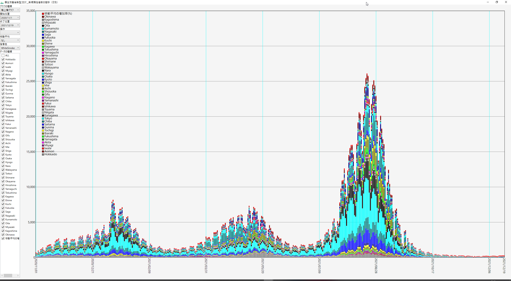

# CalcApp
計算式電卓/2次元グラフ/3次元グラフ/オープンデータの表示ソフト

## 起動画面
使用する機能をダブルクリックして起動する。
多重起動できるので２つ起動して比較することもできる。

この中で使っている数式処理は自作のもので、WpfLibのYCalc.csにある。

## 計算式電卓
数式を入力して計算をおこなう。
sum,product,repeatなど繰り返し処理も行える。

よく使う末式は登録することができますが、その時に引数となる部分を[]で囲んで登録し、呼び出すると曳うの入力欄が出てくるので、引数を入力するだけで繰り返し計算できる。

## フラクタル図形

グラフィック処理を確認するために作成。よく見られるフラクタル図形を登録している。

## 関数グラフ

2次元の関数をグラフ表示する。
一般的な1次元方程式 y = f(x) だけではなく、媒介変数を使った方程式 x = f(t) y = g(t) や極方程式 r = f(t) も使える

## 三次元関数グラフ

OpenGLを使った三次元関数のグラフ表示ツールで、一般的な1次元方程式(直交座標) z = f(x,y)、媒介変数(パラメトリック)を使った方程式 x = f(s,t), y = g(s,t), z = h(s,t) が使える。
OpenGLのラッパーにOpenTKを使用していて、自前のWpf3DLibも使用している。
表示はワイヤーフレームとサーフェスモデルの両方で使用できる。

ワイヤーフレームモデル

サーフェスモデル

## 表・グラフ化ツール

Web上のオープンデータを読み込んで表示する。
CSV形式のオープンデータを直接読み込んで、表形式にし、簡単な編集をおこなってグラフ表示をおこなう。

Web上のデータを読み込んだ状態

表の編集コマンド

データの編集には数式処理でも対応する

グラフ表示では折線や棒グラフなどで表示する

